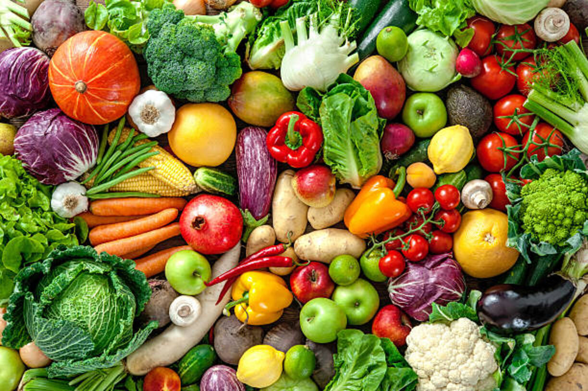

# Fresh-Farms-Fruit-Sales-Analysis

## Introduction
This project analysis brings out insights on sales performance on different products of Farm Fresh company across different countries
This helps the company to identify areas of high performance and also to improve on areas of low performance.

**_Disclaimer:_** The data set udes does not contain actual facts from any establishded farm.

## Problem Statement
- What is the total Amount made per month and the volume of product per month?
- How much is made per country and what is the volume of product per country?
- Total Volume of each Product made per country is what?
- How much is generated by each Product?
- What is the monthly turn up of each countrty?

## Skills Demostrated
- Visualization
- DAX and calculated colums

## Data Sourcing
Data was sources from the Web

## Data Transformation and Modelling
Nothing was done as regards to missing values but a calculted column was created using DAX.
Since it was a single data set no modelling was done.

## Analysis and Visualization

## Conclusion
- More Sales are made in the month of May and the least sales are made in the month of April
- United States makes more sales than other Countries while New Zealand generate the least amount
- Banana is the product that makes the highest revenue.
- Not all countries are making sales on the seven products
- Of the two categories of products fruits and vegetable, fruits generate more income. 

